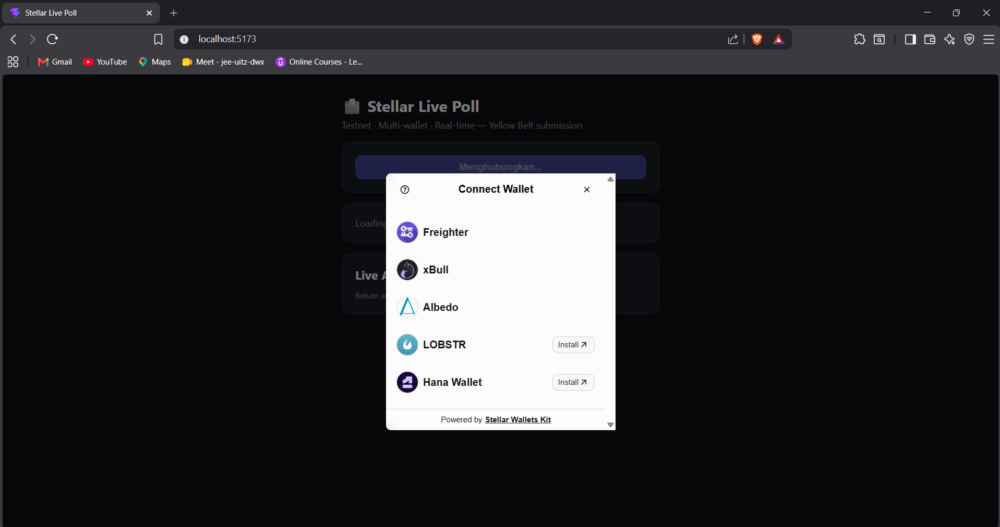
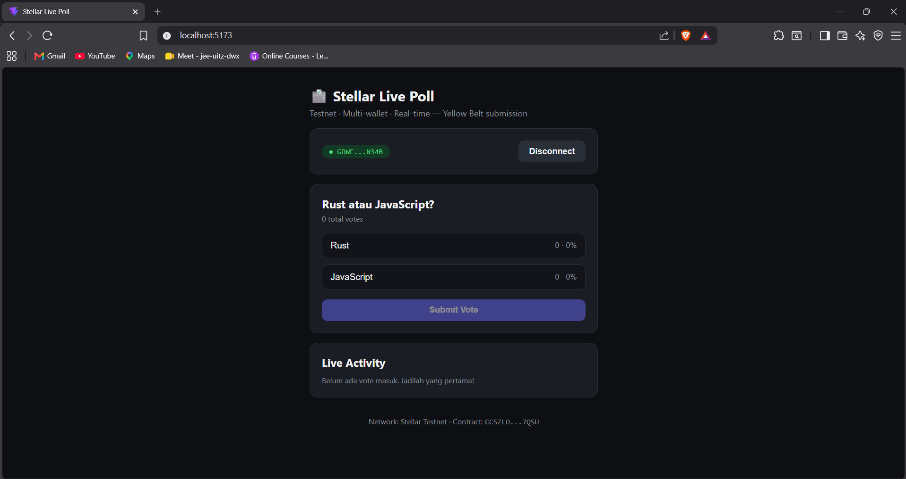
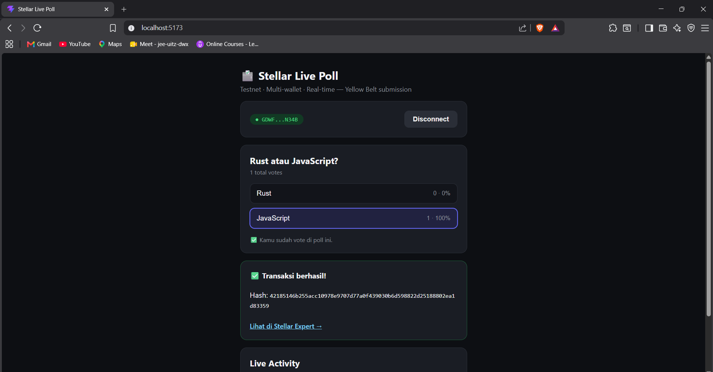
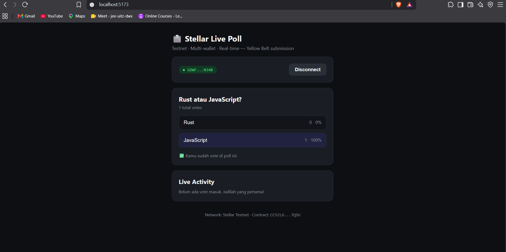

# 🗳️ Stellar Live Poll - Yellow Belt Submission

Live Poll dApp di **Stellar Testnet** dengan smart contract Soroban. Multi-wallet (Freighter, xBull, Albedo, Lobstr, Hana), vote on-chain, dan hasil yang sync real-time lewat contract events.

> 🌐 **Live Demo:** _https://stellar-poll-sakha.vercel.app_

## Project Description

Aplikasi "one-question poll" user connect salah satu dari beberapa wallet yang didukung, pilih opsi, lalu submit vote yang tercatat di smart contract Soroban di testnet. Hasil poll (jumlah vote per opsi) di-render sebagai progress bar, dan ter-update otomatis (near real-time) begitu ada vote baru masuk — baik dari diri sendiri maupun user lain — lewat polling `get_results()` + contract events.

### Fitur yang memenuhi requirement Level 2

| Requirement                   | Implementasi                                                                                                                  |
| ----------------------------- | ----------------------------------------------------------------------------------------------------------------------------- |
| StellarWalletsKit             | `@creit.tech/stellar-wallets-kit`, modul Freighter + xBull + Albedo + Lobstr + Hana → modal pilih wallet                      |
| 3+ error types handled        | `WALLET_NOT_FOUND`, `USER_REJECTED`, `INSUFFICIENT_BALANCE`, `ALREADY_VOTED`, `NETWORK_ERROR` (lihat `src/lib/errors.js`)     |
| Contract deployed on testnet  | Contract Soroban `poll-contract` (lihat `contracts/poll/`)                                                                    |
| Contract called from frontend | `vote()` (write, perlu signature) & `get_results()`/`get_question()`/`get_options()`/`has_voted()` (read-only via simulation) |
| Transaction status visible    | Banner status: `simulating → awaiting-signature → submitting → pending → success/error`                                      |
| Event listening & sync        | Poll `server.getEvents()` tiap 6 detik untuk event `vote`, update UI + activity feed                                          |

## Tech Stack

| Layer          | Tools                                                                    |
| -------------- | ------------------------------------------------------------------------ |
| Smart Contract | Rust + Soroban SDK (`contracts/poll`)                                    |
| Frontend       | React 19 + Vite (`frontend/`)                                            |
| Multi-wallet   | `@creit.tech/stellar-wallets-kit`                                        |
| Blockchain SDK | `@stellar/stellar-sdk` (rpc.Server, Contract, simulate/assemble/submit)  |
| Network        | Stellar **Testnet** (Soroban RPC: `https://soroban-testnet.stellar.org`) |

## Project Structure

```
stellar-live-poll/
├── contracts/
│   └── poll/
│       ├── src/
│       │   ├── lib.rs        # Contract: init, vote, get_results, get_question, has_voted
│       │   └── test.rs       # Unit test (cargo test — 2/2 passed)
│       └── Cargo.toml
├── frontend/
│   ├── src/
│   │   ├── lib/
│   │   │   ├── walletKit.js  # Setup StellarWalletsKit (multi-wallet)
│   │   │   ├── soroban.js    # Read/write contract, submit+poll tx, event listener
│   │   │   └── errors.js     # Klasifikasi error (3+ tipe)
│   │   ├── components/       # WalletBar, PollCard, TxStatusBanner, ActivityFeed
│   │   └── App.jsx           # State machine utama
│   └── .env.example
└── scripts/
    ├── build.sh               # Build contract ke WASM
    └── deploy.sh               # Deploy + init contract ke testnet
```

## Setup Instructions

### Bagian 1 — Smart Contract

**Prasyarat:**

- Rust ≥ 1.79 dengan target `wasm32-unknown-unknown`
- [Stellar CLI](https://developers.stellar.org/docs/tools/stellar-cli)

```bash
rustup target add wasm32-unknown-unknown
cargo install --locked stellar-cli
```

**Test contract (opsional tapi disarankan):**

```bash
cd contracts/poll
cargo test
# running 2 tests ... test result: ok. 2 passed; 0 failed
```

**Buat identity deployer & fund via friendbot:**

```bash
stellar keys generate deployer --network testnet --fund
```

**Build & Deploy:**

```bash
./scripts/build.sh
./scripts/deploy.sh "Rust atau JavaScript?" "Rust" "JavaScript"
```

Script akan print **Contract ID** — simpan untuk langkah berikutnya.

### Bagian 2 — Frontend

```bash
cd frontend
npm install
cp .env.example .env
```

Edit `.env`:

```
VITE_CONTRACT_ID=<contract id hasil deploy>
VITE_SOROBAN_RPC_URL=https://soroban-testnet.stellar.org
```

```bash
npm run dev
```

Buka `http://localhost:5173`.

### Cara Pakai

1. Klik **Connect Wallet** → pilih wallet dari daftar (Freighter/xBull/Albedo/Lobstr/Hana) di modal StellarWalletsKit.
2. Pilih salah satu opsi poll.
3. Klik **Submit Vote** → approve signing di wallet.
4. Status transaksi tampil real-time: simulating → awaiting signature → submitting → pending → success (dengan tx hash + link Stellar Expert).
5. Hasil poll & activity feed ter-update otomatis, termasuk saat user lain vote.

## Error Handling (detail)

| Kategori               | Trigger                                      | Pesan ke User             |
| ----------------------- | -------------------------------------------- | -------------------------- |
| `WALLET_NOT_FOUND`     | Extension wallet tidak terdeteksi            | Arahan install wallet     |
| `USER_REJECTED`        | User menolak popup approve/sign              | "Transaksi dibatalkan"    |
| `INSUFFICIENT_BALANCE` | Saldo XLM kurang untuk fee                   | Arahan fund via Friendbot |
| `ALREADY_VOTED`        | Contract panic `"address has already voted"` | Info sudah pernah vote    |
| `NETWORK_ERROR`        | RPC/Horizon tidak terjangkau                 | Cek koneksi & retry       |

## Deployed Contract

- **Contract ID:** `CC5ZLOTNRAGTNQBMDDQYU2PND2PX2OPUUREUVC2H2WSDEMXTPNDC7QSU`
- **Explorer:** <https://stellar.expert/explorer/testnet/contract/CC5ZLOTNRAGTNQBMDDQYU2PND2PX2OPUUREUVC2H2WSDEMXTPNDC7QSU>
- **Sample vote tx hash:** `42185146b255acc10978e9707d77a0f439030b6d598822d25188802ea1d83359`
- **Sample tx explorer link:** <https://stellar.expert/explorer/testnet/tx/42185146b255acc10978e9707d77a0f439030b6d598822d25188802ea1d83359>

## Screenshots

| State                                              | Preview                                                     |
| --------------------------------------------------- | ------------------------------------------------------------ |
| Wallet options tersedia (modal StellarWalletsKit)   |             |
| Poll terhubung + balance/opsi tampil                |             |
| Vote berhasil (tx status success + hash)            |                 |
| Live results ter-update (activity feed)             |                 |

## Live Demo

Frontend di-deploy ke Vercel/Netlify:

```bash
cd frontend
npm run build
# upload dist/, atau connect repo langsung dan set root directory = frontend
```

Environment variable yang wajib di-set di dashboard hosting: `VITE_CONTRACT_ID`, `VITE_SOROBAN_RPC_URL`.

🔗 **URL Live Demo:** _https://stellar-poll-sakha.vercel.app_

## Network Info

- Network: **Stellar Testnet**
- Soroban RPC: `https://soroban-testnet.stellar.org`
- Horizon: `https://horizon-testnet.stellar.org`
- Friendbot: `https://friendbot.stellar.org`
- Explorer: `https://stellar.expert/explorer/testnet`
